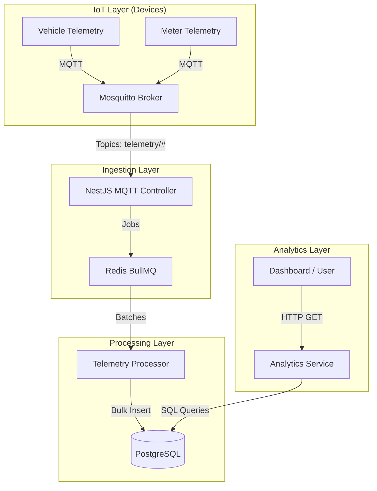

# Smart EV Analytics Engine

The **Smart EV Analytics Engine** is a production-ready backend system designed to ingest, process, and analyze high-frequency telemetry data from electric vehicles (EVs) and smart charging meters. Built with performance and scalability in mind, it handles massive data throughput (14.4 million records/day) using a microservices-based architecture that decouples data ingestion from storage and analysis.

> **Key Capabilities**: Real-time MQTT ingestion, dual-layer storage (Hot/Cold), sub-second analytical queries, and robust handling of network instability for 10,000+ IoT devices.

---

## Quick Start Guide

Follow these steps to get the system running locally in minutes:

### 1. Prerequisite Setup
Ensure you have **Docker** and **Node.js (v18+)** installed.

```bash
# Clone the repository
git clone <repository-url>
cd smart_ev_analytics

# Install dependencies
npm install
```

### 2. Infrastructure Startup
Spin up the necessary services (PostgreSQL, Mosquitto MQTT Broker, Redis) using Docker Compose.

```bash
docker-compose up -d
```
*Wait for a few seconds for the database and broker to initialize.*

### 3. Seed the Database
Populate the database with 5,000 simulated vehicles and meters to create a realistic testing environment.

- Default (uses predefined counts)

```bash
npm run seed-db
```

- Custom (uses provided counts)

```bash
npm run seed-db <VehicleCount> <MeterCount>
```

Example:
```bash
npm run seed-db 5000 5000
```

*This command generates 5,000 vehicles and 5,000 meters*

### 4. Run the Application
Start the NestJS backend in development mode.

```bash
npm run start:dev
```

### 5. Run Load Tests
Simulate real-world traffic where devices send telemetry data.

```bash
# Run a realistic load test (simulates active charging sessions)
npm run test:load-realistic <durationInMinutes>
```
Example:
```bash
# This runs a 5-minute load test simulating active charging sessions and continuous device telemetry.
npm run test:load-realistic 5
```

---

## API Reference

### 1. Vehicle Performance
**GET** `/v1/analytics/performance/:vehicleId`

Calculates efficiency ratio, AC/DC consumption, and average battery temperature for a specific vehicle over the last 24 hours.

**Example Response:**
```json
{
    "vehicleId": "e6551740-f76d-4586-82c2-86164a9b05a4",
    "totalAcConsumption": 2.877,
    "totalDcDelivery": 2.499,
    "efficiencyRatio": 0.8686131386861314,
    "avgBatteryTemp": 24.07,
    "dataPoints": 10 // Data points on which efficiency evaluated
}
```

### 2. All Vehicle States
**GET** `/v1/analytics/vehicles/states`

Retrieves the latest state (SoC, DC delivery, temperature) for all vehicles monitored by the system.

**Example Response:**
```json
[
    {
        "vehicleId": "e6551740-f76d-4586-82c2-86164a9b05a4",
        "soc": 80.72,
        "kwhDeliveredDc": 2.614,
        "batteryTemp": 28.18,
        "lastUpdated": "2026-02-11T07:55:18.295Z"
    },
    {
        "vehicleId": "e976eb7b-4f9b-419b-9936-2ae00d3cb89c",
        "soc": 55.7,
        "kwhDeliveredDc": 2.688,
        "batteryTemp": 20.3,
        "lastUpdated": "2026-02-11T07:55:18.295Z"
    }
    {...},
    {...},
]
```

---

## System Architecture

The system follows an event-driven loop aimed at maximizing write throughput while maintaining query performance.



---

## Architectural Decisions & Tradeoffs

### 1. Data Correlation & Handling 14.4M Records
I process ~14.4M telemetry records per day from vehicles (DC) and smart meters (AC). To handle this efficiently:

*   **Time-based partitioning**: I partition telemetry tables monthly in PostgreSQL so queries only scan relevant data instead of the entire dataset. This keeps indexes small and queries fast.
*   **Data Correlation Strategy**: Vehicles (DC) and Meters (AC) report data independently to avoid blocking each other. We correlate them using a dedicated `vehicle_meter_mapping` table.
* **Aggregate before joining**: I don’t join raw telemetry tables (millions of rows). I first compute daily aggregates for vehicles and meters separately, then join the summarized results. This keeps query performance under a second even at scale.

### 2. Technology Choices & Tradeoffs

#### 2.1 Protocol – MQTT instead of HTTP

**Why I chose it:**
MQTT has much smaller headers (~50 bytes vs ~400 bytes in HTTP), which saves significant bandwidth for cellular IoT devices sending frequent telemetry.

**Tradeoff:**
MQTT requires maintaining a stateful broker connection, which adds operational complexity compared to simple stateless HTTP requests.

---

#### Queueing – BullMQ (Redis) instead of In-Memory Queue

**Why I chose it:**
At ~10k messages per second, traffic can spike. Redis acts as a buffer and provides persistence. If the app crashes, queued jobs are not lost.

**Tradeoff:**
Requires running and maintaining Redis, which adds infrastructure overhead compared to a simple in-memory queue.

---

#### Storage – Raw SQL instead of ORM

**Why I chose it:**
I use raw SQL with `UNNEST` for batch inserts, allowing thousands of records to be inserted in a single transaction. This significantly improves write performance.

**Tradeoff:**
Raw SQL is more verbose and easier to mess up compared to using an ORM like TypeORM, but the performance gain is worth it at this scale.

